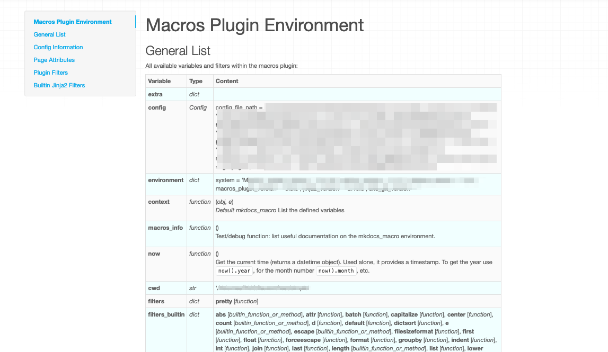

mkdocs-macros
=============
** 一个插件，通过使用变量和宏来释放[Mkdocs](https://www.mkdocs.org/)的强大功能。 **

!!! Tip "一个迷你框架"
    Mkdocs-macros不仅仅是一个“插件”。它是一个**迷你框架**开发的目标只有一个:
    
    **使用[wiki引擎](https://wiki.c2.com/?WikiEngine)可用的宏和自动化功能来增强mkdocs.** [^6]

    有关更多信息，请参见[为什么这个项目?](为什么)
    

[^6]: 参考现有的wiki引擎，如[Dokuwiki](https://www.dokuwiki.org/dokuwiki)或[Atlassian Confluence](https://www.atlassian.com/software/confluence).

## 概述

### 定义

**mkdocs-macros-plugin** is a plugin/framework that
makes it easy for contributors
of an [MkDocs](https://www.mkdocs.org/) website to produce richer and more beautiful pages. It can do two things:

1. Transforming the markdown pages
into [Jinja2](https://jinja.palletsprojects.com/en/2.11.x/) templates
that:  
     - Use environment or custom **variables**, 
     - Call pre-defined or custom **macros**, 
     - Exploit standard or custom **filters**
1. **Replacing MkDocs plugins** for a wide range of tasks: e.g. manipulating the navigation, adding files after the html pages have already been generated etc.

The capabilities of **mkdocs-macros-plugin** are such 
that it can be called a **"mini-framework"**.

**mkdocs-macros-plugin** is very easy to use **out of the box**,
even for small documentation projects: it provides
data about the platform, the git repository (if any), etc. 


### 变量
Regular **variables** are loaded with each markdown page which is 
being rendered.

Variables can be defined in five different ways:

  1. **Global**, i.e. for the whole documentation project:
    1. (for designers of the website): in the `mkdocs.yml` file,
       under the `extra` heading
    2. (for contributors): in external yaml definition files
    3. (for programmers): in a module (Python),
    by adding them to a dictionary
  2. **Local**, i.e. in each Markdown page (for contributors): 
    1. in the YAML header
    2. in the text, with a ``
 statement


### 用模板丰富降价

You can leverage the power of Python in markdown thanks to jinja2
by writing this :

```markdown
The unit price of product A is {{ unit_price }} EUR.
Taking the standard discount into account,
the sale price of 50 units is {{ price(unit_price, 50) }} EUR.
```

If you defined a `price()` function, this could translate into:

```
The unit price of product A is 10.00 EUR.
Taking the standard discount into account,
the sale price of 50 units is 450.00 EUR.
```


It is possible to use the wide range of facilities provided by
[Jinja2 templates](http://jinja.pocoo.org/docs/2.10/templates/).

### 创建自己的宏和过滤器

Instead of creating countless new plugins, programmers can define 
their **macros** and **filters**.

!!! Note "Getting Started with Macros"
    Need a function to display some repetitive markdown,
    or environment information? 

    If you are a Python programmer, go ahead and  **[create your own
    macros and filters in Python!](macros)**

    It's actually much, much easier than writing 
    a VBA function for Excel...

    Create a `main.py` file in the top directory of your mkdocs
    project and add this call:

        import ...

        def define_env(env):
          "Hook function"

          @env.macro
          def mymacro(...)
              ...
              return some_string
    

    You can insert a call in any markdown page of your project:

        {{ mymacro(...) }}

    Restart your mkdocs server.
    
    Et _voilà_ !


!!! Tip "Producing HTML"
    The result of a macro can also be **HTML code**:
    this makes macros especially useful
    to make custom extensions to the syntax of markdown, such as buttons,
    calls to email, embedding YouTube videos, etc.

### 促进大型或复杂的文档项目
mkdocs-macros was also developed with 
[**large or complex projects in mind**](advanced).

You can include separate configurations files, import Jinja2 macro definitions,
add "post-production" elements to your website, etc.

You can go all the way as to pre-package modules
into [**pluglets**](pluglets) that can be installed as Python packages.


!!! Note

    By using mkdocs-macros, you can **cut down the number of plugins required**
    for your documentation project.

    In a wide range of cases, **[writing your own module with macros](macros)**
    (Python functions for a single website), 
    could **save the effort of developing
    _new_ plugins for mkdocs**.


## 安装

### 先决条件

  - Python version > 3.5
  - MkDocs version >= 1.0 (it should work > 0.17
    (it should be compatible with post 1.0 versions)

### 标准安装
```
pip install mkdocs-macros-plugin
```

If you wish to also run the tests or rebuild the project's documentation:

```
pip install 'mkdocs-macros-plugin[test]'
```

### "手动安装"
To install the package, download the code from its
[github page](https://github.com/fralau/mkdocs_macros_plugin/) and run:

```python
python setup.py install
```

### 宏插件的声明

在文件 `mkdocs.yml` 中声明插件:

```yaml
plugins:
    - search
    - macros
```

!!! Warning
    如果你在你的配置文件中创建`plugins`条目，你还应该为`search`插件插入一行。

    在没有`plugins`条目的情况下，MkDocs默认启用`search`。
    但是当它出现时，如果你想使用它，那么你必须显式地声明它。

### 检查它是否工作正常

!!! Tip
    The recommended way to check that the plugin works properly is to add the 
    following command in one of the pages of your site (let's say `info.md`):

    ```
    {{ macros_info() }}
    ```

In the terminal, restart the environment:

```
> mkdocs serve
```
You will notice that additional information now appears in the terminal:

```
INFO    -  Building documentation...
[macros] Macros arguments: {'module_name': 'main', 'include_yaml': [], 'j2_block_start_string': '', 'j2_block_end_string': '', 'j2_variable_start_string': '', 'j2_variable_end_string': ''}
```

Within the browser (e.g. http://127.0.0.1:8000/info), you should
see a description of the plugins environment: 



如果你看到了这个信息，你应该都设置好了。

好好看看这个通用列表，因为它让你大致了解了你可以用宏插件做什么。

其他部分提供了更详细的信息。

### 插件配置

下面是MkDocs配置文件`plugin`部分中所有可能的参数:

| Argument                   | Default | Description                                                                                                                                                            |
| -------------------------- | ------- | ---------------------------------------------------------------------------------------------------------------------------------------------------------------------- |
| `module_name`              | `main`  | [Python模块名称](python/#local-module)包含宏、过滤器和变量。表示文件或目录，没有扩展名;您可以指定一个路径(例如:`include/module`)。如果没有`main`模块可用，它将被忽略。 |
| `modules`                  | `[]`    | [预安装的Python模块列表](python/#adding-pre-installed-modules), i.e. listed by `pip list`.                                                                             |
| `include_dir`              |         | [用于包含外部文件的目录](advanced/#changing-the-directory-of-the-includes)                                                                                             |
| `include_yaml`             | `[]`    | [要包含的yaml文件或`key: filename`对的列表](advanced/#including-external-yaml-files)                                                                                   |
| `j2_block_start_string`    |         | [非标准的Jinja2开始块标记](advanced/#solution-3-altering-the-syntax-of-jinja2-for-mkdocs-macros)                                                                       |
| `j2_block_end_string`      |         | [非标准的Jinja2块结束标记](advanced/#solution-3-altering-the-syntax-of-jinja2-for-mkdocs-macros)                                                                       |
| `j2_variable_start_string` |         | [变量开始的非标准Jinja2标记](advanced/#solution-3-altering-the-syntax-of-jinja2-for-mkdocs-macros)                                                                     |
| `j2_variable_end_string`   |         | [变量结束的非标准Jinja2标记](advanced/#solution-3-altering-the-syntax-of-jinja2-for-mkdocs-macros)                                                                     |


___
例如:

```yaml
plugins:
  - search
  - macros:
      module_name: mymodule
      include_dir: include
```
